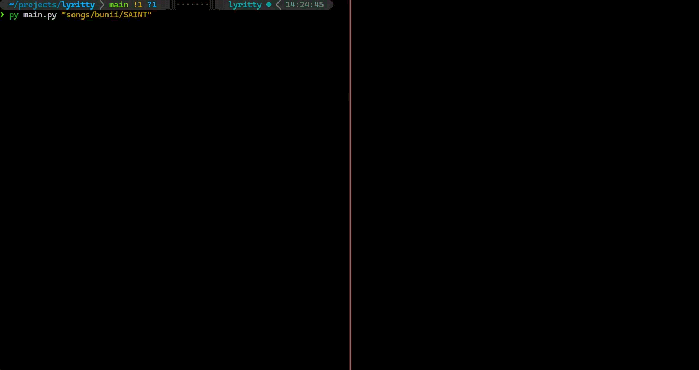

# Lyritty

A terminal-based lyrics display tool that shows song lyrics in big Unicode block letters, synchronized with audio playback.

## Features

- 🎵 **Audio Synchronization**: Play lyrics in sync with MP3 files
- 📝 **LRC Support**: Uses standard LRC format for lyrics with timestamps
- 🎨 **Big Block Letters**: Displays lyrics in large Unicode block characters
- 🎯 **Centered Display**: Text is centered both horizontally and vertically in the terminal
- 🔇 **Optional Audio**: View lyrics without audio if no audio file is provided
- ⌨️ **Simple Controls**: Press Ctrl+C to exit, auto-exits when song ends

## Installation

1. Clone or download this project
2. Install dependencies using pip with the project file:
   ```bash
   pip install .
   ```
   Or with `uv`:
   ```bash
   uv pip install .
   ```
   Or install globally with `pipx`:
   ```bash
   pipx install .
   ```
3. Install system libraries (Fedora):
   ```bash
   sudo dnf install SDL2-devel SDL2_image-devel SDL2_mixer-devel SDL2_ttf-devel
   ```

## Usage

If installed globally use `lyritty` instead of `python main.py`

### By song path (looks for `.lrc` and `.mp3` files):
```bash
python main.py songs/example
```

### By explicit files:
```bash
python main.py -l songs/example.lrc -a songs/example.mp3
```

### View lyrics without audio:
```bash
python main.py -l songs/example.lrc
```

## Example GIF

### Plain Example


### With cava


## LRC File Format

LRC files contain lyrics with timestamps in the format:  
```
[ar:Artist Name]
[ti:Song Title]
[00:12.34]First line of lyrics
[00:15.10]Second line of lyrics
[00:18.50]Third line of lyrics
```

Word for Word lrc files are HEAVILY recommended. The program was designed around that use case. To convert word for word lyrics into a compatible format, use the helper script:  
```bash
python elrc_to_lrc.py <elrc file>
```

this will turn elrc files:  
```
[00:01.00]Enhanced <00:01.50>lrc <00:02.00>file 
```
into lrc files that look like this:
```
[00:01.00]Enhanced 
[00:01.50]lrc 
[00:02.00]file 
```

The timestamp format is `[MM:SS.MS]` (minutes:seconds.milliseconds).

## Requirements

- Python 3.10+
- pygame (for audio playback)
- pylrc (for parsing LRC files)
- System libraries: SDL2 dev packages

See `requirements.txt` for exact versions.


## Notes

- This repository contains AI generated code
- This repository does NOT provide a method of getting audio or lrc files. 
  - For audio, see [yt-dlp](https://github.com/yt-dlp/yt-dlp)
  - For lyrics, see [lsync](https://github.com/mikezzb/lyrics-sync)  
  [This "tutorial"](LSYNC.md) shows how I used lsync to generate lyrics